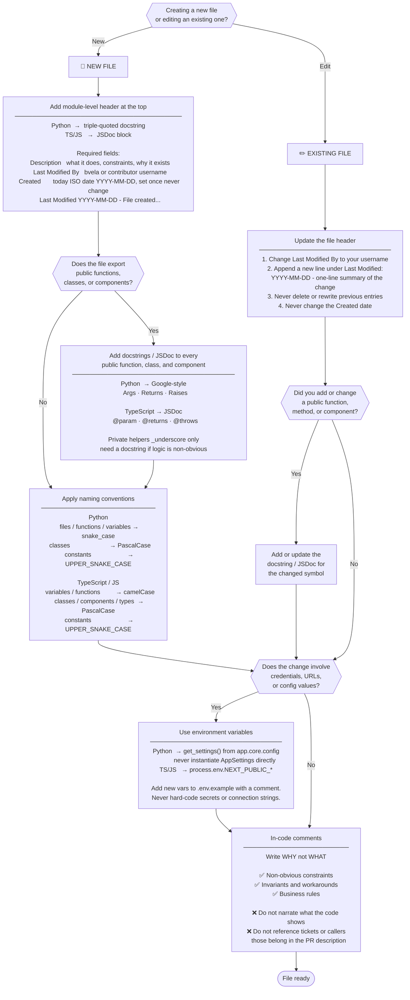
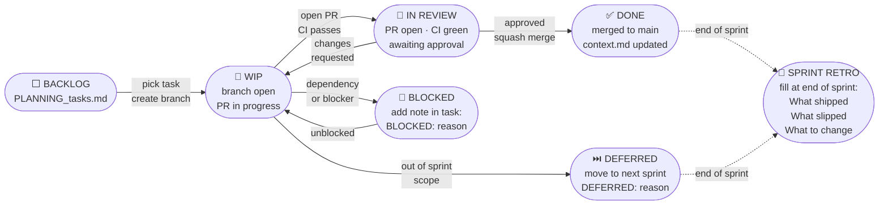

# Stockie AI — Contributing Workflow & Coding Procedures

This document is the canonical reference for **how we code and contribute** to this project.
It is written to be read by both humans and AI agents.

**Related files an agent must also read at session start:**
- [`CLAUDE.md`](../CLAUDE.md) — coding style rules, file header format, docstring format
- [`.claude/context.md`](../.claude/context.md) — active sprint, what has been built, how to run the stack
- [`docs/PLANNING_tasks.md`](./PLANNING_tasks.md) — full sprint backlog and decision log
- [`docs/PLANNING_features.md`](./PLANNING_features.md) — product feature spec

---

## Diagram 1 — Contribution Flow

How to go from "I want to work on something" to "it is merged into main".

```mermaid
flowchart TD

    %% ── Entry point ─────────────────────────────────────────
    START([Start of every session])
    READ_CONTEXT["📖 Read .claude/context.md\n─────────────────────────\nActive sprint · built files\narchitectural decisions\nhow to run the stack"]

    START --> READ_CONTEXT

    %% ── Pick a task ─────────────────────────────────────────
    PICK["Pick the next ⬜ task\nfrom PLANNING_tasks.md\n(current sprint first)"]
    READ_CONTEXT --> PICK

    NEW_DEP{{"Requires a new\ndependency, framework,\nor arch pattern?"}}
    PICK --> NEW_DEP

    ASK_FIRST["🛑 Ask the user before\nproceeding.\nDocument decision in\nPLANNING_tasks.md §7"]
    NEW_DEP -- Yes --> ASK_FIRST
    ASK_FIRST --> BRANCH

    %% ── Branch ──────────────────────────────────────────────
    BRANCH["Create a branch from main\n──────────────────────────\nfeat/<short-desc>   new feature\nfix/<short-desc>    bug fix\nchore/<short-desc>  tooling/deps\ndocs/<short-desc>   docs only\n\nRules: lowercase · hyphen-separated\n≤ 40 chars · no direct push to main"]
    NEW_DEP -- No --> BRANCH

    %% ── Code ────────────────────────────────────────────────
    CODE["✏️ Write the code\n──────────────────\nSee Diagram 2 for file rules\nSee CLAUDE.md for style rules\nValidate at boundaries only\nNo magic numbers or strings\nFunctions ≤ 30–40 lines"]
    BRANCH --> CODE

    %% ── Tests ───────────────────────────────────────────────
    WRITE_TESTS{{"Does the change\nhave testable\nbehaviour?"}}
    CODE --> WRITE_TESTS

    TESTS["Write / update tests\n──────────────────────\nBackend:  uv run pytest -v\nFrontend: npx tsc --noEmit\n\nTests mirror the source tree.\nUnit tests for business logic.\nDo not mock the database unless\nthe service is truly external."]
    WRITE_TESTS -- Yes --> TESTS
    WRITE_TESTS -- No --> LINT

    TESTS --> LINT

    %% ── Lint ────────────────────────────────────────────────
    LINT["🔍 Run linters locally\n──────────────────────────────\nBackend:\n  uv run ruff check .\n  uv run black --check .\n  uv run mypy app/\n\nFrontend:\n  npm run lint\n  npm run format:check\n  npx tsc --noEmit\n\nOr: pre-commit run --all-files"]
    LINT_PASS{{"All checks\npass?"}}
    LINT --> LINT_PASS

    FIX["Fix lint / type errors\nnever use --no-verify\nor skip hooks"]
    LINT_PASS -- No --> FIX
    FIX --> LINT

    LINT_PASS -- Yes --> COMMIT

    %% ── Commit ──────────────────────────────────────────────
    COMMIT["📝 Commit — Conventional Commits\n─────────────────────────────────\nfeat:     new feature\nfix:      bug fix\nrefactor: no behaviour change\ntest:     tests only\ndocs:     documentation only\nchore:    tooling / deps / config\n\nKeep each commit focused.\nOne logical change per commit."]
    COMMIT --> PR

    %% ── PR ──────────────────────────────────────────────────
    PR["Open Pull Request → main\n──────────────────────────────\nUse the PR template\nFill every checklist item\nLink to the sprint task\ne.g. Closes #42\n\nCI runs automatically:\n  backend: ruff + black + mypy + pytest\n  frontend: eslint + prettier + tsc"]
    CI_PASS{{"CI green?"}}
    PR --> CI_PASS

    FIX_CI["Fix failing CI step\nread the job log\nnever skip checks"]
    CI_PASS -- No --> FIX_CI
    FIX_CI --> COMMIT

    CI_PASS -- Yes --> REVIEW

    %% ── Review ──────────────────────────────────────────────
    REVIEW["👀 Other person reviews\n──────────────────────────\n@bvela reviews frontend PRs\n@despinoza reviews backend PRs\nEither reviews shared changes\n\nSquash-merge preferred\nto keep main history clean"]
    APPROVED{{"PR approved?"}}
    REVIEW --> APPROVED

    REVISE["Address review feedback\nPush new commits\ndo NOT force-push"]
    APPROVED -- Changes\nrequested --> REVISE
    REVISE --> CI_PASS

    MERGE["✅ Squash and merge to main"]
    APPROVED -- Approved --> MERGE

    %% ── Post-merge ──────────────────────────────────────────
    UPDATE_CONTEXT["📋 Update .claude/context.md\n──────────────────────────────\n1. Mark task ✅ in checklist\n2. Add row to What has been built\n3. Keep Next sprint preview accurate"]
    MERGE --> UPDATE_CONTEXT
    UPDATE_CONTEXT --> DONE([Task complete])
```

---

## Diagram 2 — File Operations

Rules that apply **every time** a source file is created or edited.

---

## Diagram 3 — Sprint Task Lifecycle

How a task moves from backlog to done within a two-week sprint.

---

## Quick-reference rules for agents

These rules are derived from `CLAUDE.md` and the locked architectural decisions in `PLANNING_tasks.md §1`.

### Always do at session start
1. Read `.claude/context.md` before writing or modifying any code.
2. Identify the active sprint and the next unchecked task.

### Always do when writing code
| Rule | Detail |
|------|--------|
| File header | Every authored file gets the header. New file → full header. Existing file → update `Last Modified By` and append a dated line. |
| Docstrings | Every public function, method, and class. Google-style (Python) or JSDoc (TS/JS). |
| Types | Full type annotations everywhere. Python: PEP 484. TypeScript: strict mode. |
| Config | Read via `get_settings()` (backend) or `process.env` (frontend). Never hard-code. |
| DB driver | Always `postgresql+asyncpg://` — never the sync driver. |
| Secrets | Never in source files. Always in `.env`, always in `.env.example`. |
| Functions | ≤ 30–40 lines. If longer, extract. |
| Comments | Explain WHY. Never explain WHAT. |

### Always do after completing a task
1. Mark task `✅` in `.claude/context.md` checklist.
2. Add or update the relevant row in the "What has been built" table.
3. Keep the "Next sprint preview" section accurate.

### Never do
- Push directly to `main`.
- Instantiate `AppSettings` directly — use `get_settings()`.
- Hard-code secrets, credentials, or connection strings.
- Skip pre-commit hooks (`--no-verify`).
- Introduce a new dependency or architectural pattern without asking the user first.
- Rewrite or delete previous entries in file headers or `PLANNING_tasks.md`.
- Mock the database in integration tests unless the service is truly external.
